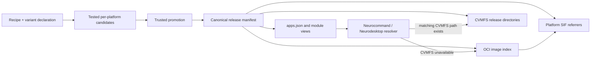

# Proposal: container identity, CVMFS layout, and OCI manifests

> Status: draft for maintainer review<br>
> Scope: `neurodesk/neurocontainers`, `neurodesk/neurocommand`, and
> `neurodesk/neurodesktop`<br>
> GitHub state reviewed: 2026-07-28

## Summary

This proposal replaces the flat CVMFS container namespace:

```text
/containers/<name>_<version>_<builddate>/
```

with an explicit release hierarchy:

```text
/containers/<name>/<version>_<variant>_<builddate>/
```

It also makes a generated release manifest, rather than a parsed filename or an
`apps.json` display key, the contract between container building, OCI
publication, CVMFS publication, module generation, local downloads, and
Neurodesktop.

The proposed OCI representation is:

- one OCI repository per logical tool, such as `quay.io/neurodesk/fsl`;
- one immutable tag per software version, product flavour, and build date;
- an OCI image index at that tag, with one child manifest per supported
  platform;
- one SIF artifact attached to each platform-specific child manifest through
  OCI 1.1 referrers; and
- one Neurodesk release-manifest artifact attached to the top-level image
  index.

The important distinction is that a Neurodesk product **flavour** such as
`default`, `gpu`, `cuda12`, or `mpi` is not an OCI platform variant.
Architecture selection belongs in the OCI image index. Product flavour remains
an explicit release dimension and, where necessary, an OCI tag dimension.

The recommended rollout is additive. New and legacy paths and tags should be
published together until Neurocommand, Neurodesktop, external HPC module users,
and maintenance jobs have moved to the manifest-backed resolver. No existing
container should be moved or deleted as the first step.

## Proposed decisions

1. Define a release as the tuple:

   ```text
   (name, software_version, flavour, platform, build_date)
   ```

2. Derive a concrete CVMFS `variant` identifier from `flavour` and `platform`:

   | Flavour | OCI platform | CVMFS variant |
   |---|---|---|
   | `default` | `linux/amd64` | `amd64` |
   | `default` | `linux/arm64` | `arm64` |
   | `gpu` | `linux/amd64` | `gpu-amd64` |
   | `gpu` | `linux/arm64` | `gpu-arm64` |
   | `cuda12` | `linux/amd64` | `cuda12-amd64` |

3. Keep the logical tool name stable across platforms. For example, ARM FSL is
   represented as `name=fsl`, `platform=linux/arm64`, rather than requiring
   `name=fsl_arm64`.

4. Never infer release fields by splitting an application display name, OCI
   repository, or CVMFS path. Those strings are projections of explicit
   metadata.

5. Use an OCI image index for architecture selection. Do not use OCI
   `platform.variant` for Neurodesk concepts such as `gpu`; OCI defines that
   field for CPU variants such as ARM `v8` or x86-64 `v2`.

6. Attach each SIF to the platform-specific child manifest, not only to the
   top-level multi-platform index. A SIF is architecture-specific and should
   have one unambiguous subject.

7. Treat immutable tags and digests as release identities. Floating tags are
   convenience pointers only and must never be recorded as the reproducibility
   reference.

8. Generate `apps.json`, CVMFS inventory, modulefiles, cleanup keep-lists, and
   application lists from release manifests. `cvmfs/log.txt` can remain as a
   compatibility output during migration, but not as the source of truth.

## Motivation

### The current filename is carrying too many meanings

Current code commonly assumes that a container is exactly:

```text
<name>_<version>_<YYYYMMDD>
```

This assumption appears in:

- [`neurodesk/fetch_containers.sh`](neurodesk/fetch_containers.sh);
- [`neurodesk/fetch_and_run.sh`](neurodesk/fetch_and_run.sh);
- [`neurodesk/transparent-singularity/run_transparent_singularity.sh`](neurodesk/transparent-singularity/run_transparent_singularity.sh);
- [`cvmfs/reconcile_module_files.py`](cvmfs/reconcile_module_files.py);
- [`cvmfs/sync_containers_to_cvmfs.sh`](cvmfs/sync_containers_to_cvmfs.sh);
- [`containers.sh`](containers.sh);
- [`.github/workflows/upload_containers_simg.sh`](.github/workflows/upload_containers_simg.sh);
- DOI and stale-object maintenance workflows; and
- `neurodesktop/config/test_neurodesktop.sh` in the Neurodesktop repository.

That works for the 365 current entries in `cvmfs/log.txt`, all of which have
exactly two underscores. It does not provide a durable grammar for names,
versions, product flavours, and architectures that may themselves contain
delimiters.

Draft Neurocommand PR
[#767](https://github.com/neurodesk/neurocommand/pull/767) correctly makes the
legacy parser work from the right, allowing concrete names such as
`fsl_gpu_arm64`. That is a useful compatibility fix, but continuing to improve
filename parsing would leave the filename as an undocumented database schema.

### Variant and multi-architecture work is already active

The relevant work is not hypothetical:

- Neurocontainers issue
  [#1092](https://github.com/neurodesk/neurocontainers/issues/1092) requests
  first-class container variations.
- Neurocommand issue
  [#733](https://github.com/neurodesk/neurocommand/issues/733) tracks ARM
  publication and contains maintainer direction to make variation a general
  builder feature.
- Draft Neurocontainers PR
  [#2913](https://github.com/neurodesk/neurocontainers/pull/2913) implements
  variant fan-out for default, ARM, GPU, CUDA, and combined variants.
- Draft Neurocommand PR
  [#767](https://github.com/neurodesk/neurocommand/pull/767) adapts deployment,
  module reconciliation, menu generation, and cleanup to those concrete names.
- Neurocontainers issue
  [#2593](https://github.com/neurodesk/neurocontainers/issues/2593) records
  agreement to publish multi-architecture artifacts under the same OCI tags and
  let clients select the appropriate object.

The builder fan-out in PR #2913 should be preserved. This proposal changes how
the resulting axes are represented at the distribution boundary: base name,
flavour, and platform remain separate fields instead of being recoverable only
from a concatenated concrete name.

### Release metadata already needs to become authoritative

Neurocontainers issue
[#2796](https://github.com/neurodesk/neurocontainers/issues/2796) asks full
tests to resolve an artifact from release metadata instead of hard-coded SIF
wildcards. Neurocommand issue #733 documents how ARM artifacts that existed in
release metadata were omitted from `apps.json` and then deleted by cleanup
because cleanup used the UI publication view as its keep-list.

Draft Neurocontainers PR
[#2914](https://github.com/neurodesk/neurocontainers/pull/2914) is a strong
foundation: it binds a tested Docker archive, SIF, checksum, recipe fingerprint,
commit, PR, and generated release JSON into a promotion manifest. The layout
work should extend that manifest to cover every flavour and platform, rather
than introduce a second metadata path.

### CVMFS is naturally hierarchical

CVMFS recommends nested catalogs at software release boundaries because
releases are normally immutable and clients generally use only one release at a
time. The new `<name>/<release>` hierarchy gives us a stable place for that
boundary and avoids putting every release directly in the large
`/containers` directory.

## Terminology and identity rules

### Logical name

`name` is the stable recipe/tool identity, for example `fsl`, `dcm2niix`, or
`deepretinotopy`.

- It is the Neurocontainers recipe directory name.
- It is the OCI repository name.
- It is the first directory beneath CVMFS `/containers`.
- It does not include architecture.
- It does not include the default product flavour.

### Software version

`software_version` is the upstream tool version, not the container build date.
The existing release JSON field named `version` inside an app currently stores
the build date, so the new schema must use unambiguous names during migration:

```json
{
  "software_version": "6.0.7.16",
  "build_date": "20260728"
}
```

For the proposed underscore-delimited CVMFS release directory, new software
versions should be restricted to:

```text
[A-Za-z0-9][A-Za-z0-9.+-]*
```

In particular, `_` and `/` are not permitted in a newly published version.
Existing versions should be audited before enforcing this. Code must still use
manifest fields rather than parse the release directory.

### Flavour

`flavour` describes a Neurodesk product/build choice such as:

```text
default
gpu
cuda12
mpi
openrecon
```

It is independent of CPU architecture. A recipe may constrain a flavour to a
set of supported platforms.

Flavour identifiers should match:

```text
[a-z0-9][a-z0-9.-]*
```

This deliberately excludes `_`, keeping the CVMFS release directory
human-readable and delimiter-safe.

### Platform

`platform` uses OCI terminology:

```text
linux/amd64
linux/arm64
```

Recipe aliases such as `x86_64` and `aarch64` can remain accepted at input, but
release metadata should normalize them to OCI values. If a genuine CPU variant
is required, it is recorded separately, for example:

```json
{
  "os": "linux",
  "architecture": "arm64",
  "variant": "v8"
}
```

### CVMFS variant

The `variant` in the requested CVMFS path is a concrete, filesystem-safe
projection of flavour and platform:

```text
default + amd64 -> amd64
default + arm64 -> arm64
gpu     + amd64 -> gpu-amd64
gpu     + arm64 -> gpu-arm64
```

This projection is generated and stored in the release manifest as
`cvmfs_variant`; clients do not reconstruct it.

### Build date and immutability

`build_date` remains an eight-digit UTC date:

```text
YYYYMMDD
```

An immutable tag or CVMFS release directory must not be overwritten with
different content. Promotion must fail if the same
`(name, version, flavour, build_date)` already exists with another digest.

This implies at most one distinct release of a name/version/flavour on a UTC
date. If same-day rebuilds are required, maintainers should approve an extended
build identifier such as `YYYYMMDD.2` before implementation. A source commit and
content digests remain mandatory even when the date is unique.

## Proposed CVMFS layout

Example:

```text
/cvmfs/neurodesk.ardc.edu.au/
├── containers/
│   ├── fsl/
│   │   ├── 6.0.7.16_amd64_20260728/
│   │   │   ├── .cvmfscatalog
│   │   │   ├── release.json
│   │   │   ├── commands.txt
│   │   │   ├── bin/
│   │   │   └── rootfs/
│   │   ├── 6.0.7.16_arm64_20260728/
│   │   │   └── ...
│   │   └── 6.0.7.16_gpu-amd64_20260728/
│   │       └── ...
│   ├── dcm2niix/
│   │   └── v1.0.20240202_arm64_20260728/
│   │       └── ...
│   └── modules/
└── neurodesk-modules/
```

Each release directory is immutable after a successful publish.

### Release directory contents

`release.json`
: A byte-for-byte copy of the generated release manifest. It allows inspection
  without consulting GitHub or an OCI registry.

`rootfs/`
: The unpacked SIF/sandbox tree served lazily by CVMFS. The current layout uses
  a directory ending in `.simg`, which looks like a file but is an unpacked
  directory. `rootfs` makes the on-disk representation explicit.

`commands.txt`
: The validated command inventory generated from the recipe deploy contract.
  Publication fails if it is missing or empty.

`bin/`
: Generated transparent wrappers. Modulefiles prepend this directory, rather
  than relying on every file in the release root being executable.

Additional generated files such as environment metadata may remain in the
release root, but every field used to regenerate them must be present in
`release.json`.

### Catalog boundaries

Every release directory should be a nested catalog root. Prefer a repository
policy such as a `.cvmfsdirtab` rule for `/containers/*/*` over ad hoc marker
creation. That rule must explicitly exclude `/containers/modules/*` and any
compatibility-alias subtree so they are not accidentally treated as release
catalogs.

The current publisher also creates nested catalogs inside the unpacked image at
`usr`, `usr/lib`, and `usr/share`. Those deeper boundaries should initially be
preserved for compatibility, then retained or removed based on
`cvmfs_server list-catalogs -e` measurements. A release catalog should generally
contain more than 1,000 and fewer than roughly 200,000 entries; very large
rootfs trees may still need internal catalogs.

### What CVMFS retains

Following the direction in Neurocontainers issue #2593:

- CVMFS stores the current active release snapshot needed for normal execution.
- Git and OCI retain the full release-manifest history.
- OCI and archival object storage retain old immutable SIFs by digest.
- Withdrawal disables the active wrappers/module pointer before payload
  removal.
- Reproducibility instructions resolve an old manifest to an OCI digest even
  after that release is no longer materialized in CVMFS.

An artifact is never deleted merely because it is hidden from a menu or absent
from `apps.json`.

## Proposed OCI layout

### Repositories and tags

Use one repository per logical name:

```text
quay.io/neurodesk/<name>
ghcr.io/neurodesk/<name>
```

Immutable default-flavour tag:

```text
<software_version>_<build_date>
```

Immutable named-flavour tag:

```text
<software_version>_<flavour>_<build_date>
```

Examples:

```text
quay.io/neurodesk/fsl:6.0.7.16_20260728
quay.io/neurodesk/fsl:6.0.7.16_gpu_20260728
```

These preserve the v2 direction in Neurocontainers issue
[#2408](https://github.com/neurodesk/neurocontainers/issues/2408), while adding
an explicit product-flavour dimension.

After all immutable objects and metadata have been verified, promotion may
advance these convenience tags:

```text
<software_version>
<software_version>_<flavour>
latest
```

`latest` refers only to the default flavour. A flavour-specific `latest` tag
should not be added until there is a concrete client requirement and an agreed
naming rule.

### Image index

The immutable tag resolves to an OCI image index:

```text
fsl:6.0.7.16_20260728
  ├── linux/amd64 -> image manifest sha256:...
  └── linux/arm64 -> image manifest sha256:...
```

The index contains standard platform descriptors. Architecture must not also be
encoded into the OCI repository name or immutable tag.

A named product flavour gets another index:

```text
fsl:6.0.7.16_gpu_20260728
  └── linux/amd64 -> image manifest sha256:...
```

If a flavour later supports ARM, an ARM child can be added only while the
release is still a candidate. An immutable published index must never be
mutated; a changed platform set requires a new build date.

### SIF artifacts

Attach a SIF to each child image manifest with:

```text
artifactType: application/vnd.sylabs.sif.layer.v1.sif
subject:       <platform-specific image-manifest digest>
```

Recommended descriptor/manifest annotations include:

```text
org.opencontainers.image.title
org.opencontainers.image.version
org.opencontainers.image.created
org.neurodesk.name
org.neurodesk.software-version
org.neurodesk.flavour
org.neurodesk.platform
org.neurodesk.build-date
org.neurodesk.sif.sha256
```

The labels proposed in Neurocontainers issue
[#2409](https://github.com/neurodesk/neurocontainers/issues/2409) remain
applicable to the runnable image manifests. Equivalent annotations should be
placed on the index and SIF artifact where useful.

The resolver must:

1. resolve an immutable tag to the top-level index digest;
2. select the exact child descriptor for the host/requested platform;
3. query referrers for that child digest;
4. filter by the SIF artifact type;
5. verify each returned manifest's subject, platform annotations, and expected
   checksum;
6. reject zero or multiple matching SIFs unless the release manifest identifies
   one exact digest; and
7. pull the SIF by digest, never by a floating tag.

The current transparent-singularity implementation takes the first matching
referrer. That is sufficient as an initial v2 experiment but is not a durable
selection rule.

### Registry compatibility

OCI Distribution 1.1 defines the native
`/v2/<name>/referrers/<digest>` endpoint and requires clients to fall back to
the referrers tag schema when that endpoint returns `404`.

Quay currently exposes a native referrers endpoint. The current Neurocommand
code uses native referrers for Quay and the tag-schema fallback for GHCR. The
shared resolver should implement the OCI fallback once rather than maintain
registry-specific `curl` pipelines in shell.

Neurocontainers issue #2408 describes Quay as primary and GHCR as a mirror,
whereas PR #2914 currently treats GHCR as release-critical and Quay as
best-effort. Until maintainers ratify one policy, the release manifest should
record an ordered registry list with a separate index, child, and SIF digest for
each registry. Clients must not assume different registries preserve identical
manifest digests.

## Release manifest

### Storage

Replace the current one-file-per-version history:

```text
releases/<name>/<version>.json
```

with:

```text
releases/<name>/<software_version>/<flavour>/<build_date>.json
```

For example:

```text
releases/fsl/6.0.7.16/default/20260728.json
releases/fsl/6.0.7.16/gpu/20260728.json
```

This retains rebuild history instead of replacing the previous metadata for a
software version. A generated `latest.json` may exist as a compatibility view,
but it must contain or resolve to an immutable release ID.

The same canonical JSON is:

- committed by the trusted Neurocontainers promotion workflow;
- attached as
  `application/vnd.neurodesk.container-release.v1+json` to the top-level OCI
  index;
- copied to the CVMFS release directory; and
- consumed when generating Neurocommand views.

### Illustrative schema

This is a discussion schema, not a final JSON Schema:

```json
{
  "schema_version": 1,
  "release_id": "fsl/6.0.7.16/default/20260728",
  "name": "fsl",
  "software_version": "6.0.7.16",
  "flavour": "default",
  "build_date": "20260728",
  "status": "published",
  "source": {
    "repository": "neurodesk/neurocontainers",
    "recipe": "recipes/fsl",
    "git_commit": "0123456789abcdef",
    "recipe_fingerprint": "sha256:..."
  },
  "oci": {
    "immutable_tag": "6.0.7.16_20260728",
    "registries": [
      {
        "repository": "quay.io/neurodesk/fsl",
        "index_digest": "sha256:...",
        "platforms": {
          "linux/amd64": {
            "manifest_digest": "sha256:...",
            "sif_manifest_digest": "sha256:...",
            "sif_blob_digest": "sha256:...",
            "sif_sha256": "..."
          },
          "linux/arm64": {
            "manifest_digest": "sha256:...",
            "sif_manifest_digest": "sha256:...",
            "sif_blob_digest": "sha256:...",
            "sif_sha256": "..."
          }
        }
      }
    ]
  },
  "cvmfs": {
    "repository": "neurodesk.ardc.edu.au",
    "platforms": {
      "linux/amd64": {
        "variant": "amd64",
        "path": "containers/fsl/6.0.7.16_amd64_20260728"
      },
      "linux/arm64": {
        "variant": "arm64",
        "path": "containers/fsl/6.0.7.16_arm64_20260728"
      }
    }
  },
  "deploy": {
    "bins": ["fslmaths"],
    "paths": ["/opt/fsl/bin"],
    "apptainer_args": []
  },
  "apps": [
    {
      "id": "fsl",
      "label": "FSL 6.0.7.16",
      "exec": "",
      "terminal": true
    },
    {
      "id": "fsleyes",
      "label": "FSLeyes 6.0.7.16",
      "exec": "fsleyes",
      "terminal": false
    }
  ],
  "categories": [
    "functional imaging",
    "structural imaging"
  ]
}
```

The final schema should have a checked-in JSON Schema, a schema version, and
validation in both repositories. Unknown additive fields should be tolerated
within a schema version; missing identity, digest, platform, or deploy fields
should fail publication.

## Resolution flow



At runtime:

1. A launcher identifies an app by a stable app ID and release ID, not by
   splitting its label.
2. The resolver determines the requested flavour and normalizes the host
   platform.
3. It selects the platform entry from the release manifest.
4. If the recorded CVMFS release and `rootfs` exist, it executes that release.
5. Otherwise it resolves the recorded OCI index and child digest, discovers the
   exact SIF referrer, verifies it, and pulls it to local storage.
6. Object-storage URLs and legacy OCI layouts remain last-resort migration
   fallbacks only.

This same resolver should be used by:

- `fetch_and_run.sh`;
- `fetch_containers.sh`;
- transparent-singularity installation;
- fulltest artifact selection;
- CVMFS publication preflight;
- stale-object cleanup; and
- diagnostic tooling.

The implementation can be a small Python CLI/library shipped by Neurocommand.
Shell entrypoints should call it and consume structured JSON output. Repeating
OCI token, manifest, referrer, and filename parsing in multiple shell scripts
would recreate the current coupling.

## Repository responsibilities

### `neurodesk/neurocontainers`

Neurocontainers owns the declared and built identity:

- recipe schema for product flavours and supported platforms;
- normalization of architecture aliases;
- per-flavour/per-platform candidate fan-out;
- coordinated testing of every index child;
- generation and validation of the release manifest;
- immutable OCI image publication;
- multi-platform index creation;
- per-platform SIF attachment;
- provenance, checksum, and optional signature/attestation creation;
- release-history storage; and
- generated application metadata.

PR #2913 supplies much of the fan-out logic. It should be adapted so that
`name`, `flavour`, and `platform` survive as separate fields through the
builder, rather than only producing names such as `fsl_gpu_arm64`.

PR #2914 supplies the secure candidate-to-promotion boundary. It needs to:

- matrix over concrete flavour/platform candidates;
- include those fields in its candidate manifest and verification;
- promote all required children as one coordinated release;
- create the image index only after all required children pass;
- attach the tested SIF to each child digest;
- record post-push digests in the canonical release manifest; and
- update floating tags only after the immutable graph is complete.

The two draft PRs overlap heavily and should be rebased or integrated before
implementation of this proposal. Merging both unchanged would leave the one-PR
flow x86-only and the variant flow on the older release path.

### `neurodesk/neurocommand`

Neurocommand owns materialization and client resolution:

- validate/import Neurocontainers release manifests;
- generate `apps.json` without encoding identity in display keys;
- generate the compatibility `cvmfs/log.txt` while it is still required;
- publish the new CVMFS hierarchy;
- generate modules and wrappers from manifest fields;
- resolve local, CVMFS, and OCI locations;
- select host platform and requested flavour;
- verify OCI subjects and SIF digests;
- retain legacy local/object-store fallbacks during migration;
- drive cleanup from release state and retention policy; and
- report actionable diagnostics.

PR #767 remains valuable as a legacy parser and safety improvement. Its
right-hand parsing should be retained for old flat identities, but new paths
must use manifest fields directly.

### `neurodesk/neurodesktop`

Neurodesktop remains a consumer:

- install the manifest-backed Neurocommand resolver;
- keep CVMFS mounting and regional endpoint selection;
- configure the module path exposed by the new module view;
- use the resolver in container integration tests instead of constructing a
  flat CVMFS path; and
- keep local/offline containers compatible with the same release-directory
  shape.

No change to the CVMFS repository mount point is proposed:

```text
/cvmfs/neurodesk.ardc.edu.au
```

The changes are below its `containers` directory and in the generated module
contents.

## Known code impact

This is the minimum inventory identified during review.

| Repository | Area | Current assumption to remove or bridge |
|---|---|---|
| neurocommand | `neurodesk/write_log.py` | App display name plus build date produces the image ID. |
| neurocommand | `neurodesk/build_menu.py` | Display-name parsing derives container and version arguments. |
| neurocommand | `neurodesk/fetch_and_run.sh` | Resolves only a build date and constructs a module name. |
| neurocommand | `neurodesk/fetch_containers.sh` | Constructs `IMG_NAME=name_version_date`. |
| neurocommand | `transparent-singularity/run_transparent_singularity.sh` | Parses identity from underscores and contains registry-specific referrer logic. |
| neurocommand | `cvmfs/sync_containers_to_cvmfs.sh` | Iterates `log.txt`, creates a flat release directory, and preflights only a legacy object key. |
| neurocommand | `cvmfs/reconcile_module_files.py` | Parses image strings and rewrites paths with a flat-name regex. |
| neurocommand | `containers.sh` | Splits every log line into name/version/date columns. |
| neurocommand | `maintenance/fix_missing_bindpath-directories-on-cvmfs.sh` | Globs `/containers/*/*.simg`. |
| neurocommand | upload/cleanup workflows | Derive legacy object names by underscore fields and use `apps.json`/`log.txt` as retention truth. |
| neurocommand | DOI workflow | Derives the recipe name from the first underscore-delimited field. |
| neurodesktop | `config/jupyter/environment_variables.sh` | Hard-codes current local and CVMFS module directories. |
| neurodesktop | `config/test_neurodesktop.sh` | Constructs `/containers/package_version_date/package_version_date.simg`. |
| neurodesktop | Dockerfile/startup | Wires local container storage to Neurocommand's current `containers` directory. |
| neurocontainers | `builder/release.py` | Generates legacy ARM-specific app/image names. |
| neurocontainers | `tools/generate_apps_json.py` | Merges one mutable release file per version and currently skips legacy ARM releases. |
| neurocontainers | build/release workflows | Publish individual images before a coordinated multi-platform release graph exists. |
| neurocontainers | fulltest tooling | Historically resolves dated SIF filenames rather than a manifest platform entry. |

Tests containing literal flat paths must be updated or retained as explicit
legacy-compatibility tests, not mechanically replaced.

## Modules and application UX

The CVMFS storage identity and user-facing module identity should be separate.

Recommended module behaviour:

```text
module load fsl/6.0.7.16
```

selects the default flavour for the host platform.

An explicit flavour may be exposed as:

```text
module load fsl/6.0.7.16-gpu
```

The modulefile should not point permanently at an AMD64 path in a repository
also mounted on ARM. It can call a small resolver-generated dispatcher, or
module generation can emit platform-specific logic using a normalized
environment value set by Neurocommand/Neurodesktop.

This work should also address the broader concerns in Neurocommand issue
[#152](https://github.com/neurodesk/neurocommand/issues/152):

- do not hard-code the CVMFS mount location into generated module content;
- allow Apptainer or Singularity runtime selection;
- keep generated module sources reviewable in Git;
- make runtime flags configurable; and
- leave room for meta-modules.

An application label such as `FSLeyes 6.0.7.16` remains presentation only.
Generated launchers receive explicit `release_id`, `app_id`, and optional
`flavour`; quoting is mandatory.

## Cleanup, withdrawal, and reproducibility

Release status should be explicit:

```text
candidate -> published -> active -> deprecated -> withdrawn
```

- `published` means the immutable OCI graph and canonical manifest exist.
- `active` means normal apps/modules may select it and CVMFS should materialize
  it.
- `deprecated` remains runnable but is not the preferred floating target.
- `withdrawn` removes normal launchers/module pointers and records the reason.

Cleanup computes reachability from all non-purged release manifests, not from
the subset visible in `apps.json`.

Before deletion it must account for:

- every configured registry copy;
- OCI child manifests and their referrers;
- object-store SIFs;
- the CVMFS materialized path;
- floating tags;
- release manifests;
- an explicit retention interval; and
- withdrawal/reproducibility policy.

Dry-run output and tests are required. A UI visibility change must never make a
release eligible for deletion.

For withdrawn CVMFS content, update modules/wrappers and publish that revision
before removing `rootfs`. Old release metadata must retain an exact OCI digest
and explain how to reproduce the pull. This preserves the intent of the current
stale-container wrapper while avoiding reconstruction of a legacy Docker
reference from a filename.

## Security and integrity

- Resolve tags once, then pin and record digests.
- Verify the platform child belongs to the expected index.
- Verify a SIF artifact manifest refers to the selected child digest.
- Verify artifact type, Neurodesk identity annotations, blob digest, and SIF
  SHA-256 before execution or CVMFS publication.
- Do not select `.manifests[0]` without comparison to the canonical release
  manifest.
- Preserve the candidate checks, recipe fingerprint, PR number, head commit,
  Docker checksum, and SIF checksum introduced by PR #2914.
- Make index assembly an atomic promotion gate: no release manifest or floating
  tag is published until all required children pass.
- Record per-registry digests and verify copies after mirroring.
- Run `cvmfs_server check -s <release-path>` for pilots and regularly run the
  repository integrity checker.

Container signing and attestations from Neurocontainers issue
[#504](https://github.com/neurodesk/neurocontainers/issues/504) can be added to
the same OCI subject graph without another naming scheme. The manifest schema
should reserve typed referrer entries for signatures, SBOMs, provenance, and
security scan results.

## Migration plan

### Phase 0: ratify the contract

- Decide the open questions at the end of this document.
- Check in a versioned release JSON Schema.
- Audit current recipe names and versions against the proposed character rules.
- Decide how PRs #2913 and #2914 will be integrated.
- Freeze new one-off filename parsers while the resolver is implemented.

Exit criterion: maintainers approve the identity tuple, CVMFS variant rule, OCI
tag rule, referrer subject rule, and registry priority.

### Phase 1: generate manifests without changing publication

- Extend the one-PR candidate manifest with flavour and platform.
- Preserve release history by build date.
- Generate the proposed canonical manifest alongside current release JSON.
- Validate equivalence between the manifest and legacy image/SIF names.
- Generate `apps.json`, `log.txt`, and cleanup keep-lists from the new manifest
  in check-only mode.

Exit criterion: generated legacy outputs are byte-equivalent or have reviewed
diffs for a representative set of default, GUI, ARM, and hidden releases.

### Phase 2: publish the OCI graph

- Build and test all required platform children for a flavour.
- Push immutable child manifests.
- Create and verify the OCI image index.
- Attach each tested SIF to its child manifest.
- Attach the canonical release manifest to the index.
- Copy and verify the full subject graph in each supported registry.
- Advance floating tags last.

Exit criterion: a standalone resolver can select and pull exact AMD64 and ARM64
SIFs by manifest on both the primary registry and its fallback.

### Phase 3: dual-publish CVMFS

- Materialize the new `/containers/<name>/<release>` tree.
- Keep the old flat tree during the pilot.
- Generate both old and new module views.
- Add per-release nested catalogs and inspect their entry counts.
- Make publication idempotent and abort cleanly on a failed verification.

To avoid duplicating rootfs catalog entries, test a compatibility alias such as:

```text
/containers/fsl_6.0.7.16_20260728
  -> /containers/fsl/6.0.7.16_amd64_20260728
```

The target release may temporarily include the expected legacy inner name as a
symlink to `rootfs`. Do not replace an existing materialized legacy catalog with
this alias until Apptainer, CVMFS, module, and old-client tests pass. CVMFS
content hashing reduces duplicate blob storage during a short dual-materialized
period, but duplicate catalog entries still have a cost.

Exit criterion: legacy and new clients run the same pilot digest from the same
CVMFS revision.

### Phase 4: migrate consumers

- Move `fetch_and_run.sh`, `fetch_containers.sh`, and menu wrappers to release
  IDs.
- Move module reconciliation to manifest fields.
- Move Neurodesktop integration tests to the resolver.
- Move fulltests and CVMFS preflight to the shared resolver.
- Move cleanup and DOI jobs to canonical identity fields.
- Change diagnostics to print release ID, platform, CVMFS path, OCI subject, and
  SIF digest.

Exit criterion: repository searches find flat-name construction only in the
legacy compatibility layer and its tests.

### Phase 5: pilot and cut over

Suggested pilots:

1. `dcm2niix` or `niimath` for a small default multi-architecture release.
2. A GUI-bearing container to validate menu generation.
3. A GPU flavour after the two-platform default path is stable.

For each pilot test:

- AMD64 with CVMFS enabled;
- ARM64 with CVMFS enabled;
- both architectures with CVMFS disabled and OCI pull enabled;
- local/offline reuse;
- CLI and GUI wrappers;
- module load and explicit flavour selection;
- primary-registry failure and fallback;
- native referrers and tag-schema fallback;
- withdrawn/stale release handling; and
- Neurodesktop startup and its container test suite.

After a published compatibility window:

- stop generating new flat directories;
- retain aliases for an agreed longer window;
- remove filename parsing from normal resolution;
- remove object-store fallback only after usage is measured; and
- document the final removal release.

## Rollback

Every migration phase must remain reversible:

- immutable legacy OCI tags and SIF objects are retained;
- legacy CVMFS paths remain materialized or aliased;
- `apps.json` can point launchers back to the legacy resolver;
- floating tags can be restored to their previous recorded digests;
- a failed new CVMFS publish is aborted before the compatibility view changes;
  and
- no cleanup of legacy objects occurs until after the compatibility window.

Rollback changes pointers and generated views. It does not rebuild or overwrite
immutable content.

## Validation requirements

### Neurocontainers

- JSON Schema positive and negative tests.
- Variant matrix tests for default, ARM, GPU, and combined flavour/platform
  cases.
- Tests that architecture aliases normalize to OCI values.
- Candidate tamper tests for name, version, flavour, platform, build date,
  index digest, child digest, and SIF digest.
- Multi-platform promotion tests that refuse partial indexes.
- Tests that a same-day conflicting immutable release is rejected.
- Referrer attachment and mirrored-graph verification tests.
- Fulltest selection from a platform entry without wildcard filenames.

### Neurocommand

- Manifest loading and forward-compatible schema tests.
- Host-platform and explicit-flavour selection tests.
- CVMFS path generation tests for every variant rule.
- Legacy flat-name parsing tests from PR #767.
- Native referrers, fallback-tag, missing-referrer, multiple-referrer,
  wrong-subject, wrong-platform, and bad-digest tests.
- Module generation without a hard-coded mount path.
- Empty deploy command rejection.
- Cleanup reachability tests proving hidden and non-active retained releases are
  not deleted.
- CVMFS reconciliation tests that use manifest identity rather than regex
  replacement.

### Neurodesktop

- Startup with an externally mounted CVMFS repository.
- Startup with an internal FUSE mount.
- CVMFS-disabled OCI download.
- AMD64 and ARM64 module selection.
- Local container persistence across image upgrades.
- Test-runner lookup through release ID rather than a constructed flat path.

## GitHub context reviewed

As of 2026-07-28, this review inventoried all open items in the two requested
repositories:

- Neurocommand: 4 open issues and 1 open PR.
- Neurocontainers: 29 open issues and 2 open PRs.

Directly relevant items:

| Item | Relevance |
|---|---|
| [neurocommand#733](https://github.com/neurodesk/neurocommand/issues/733) | ARM publication, variants, parsing breakpoints, artifact cleanup, and maintainer direction. |
| [neurocommand#152](https://github.com/neurodesk/neurocommand/issues/152) | Module portability, runtime selection, configurable CVMFS mount, and reviewable module generation. |
| [neurocommand#75](https://github.com/neurodesk/neurocommand/issues/75) | Generated transparent-singularity paths become stale when local storage moves. |
| [neurocommand#13](https://github.com/neurodesk/neurocommand/issues/13) | Broader packaging of Neurocommand; no direct layout requirement. |
| [neurocommand#767](https://github.com/neurodesk/neurocommand/pull/767) | Draft end-to-end concrete variant support and the required legacy compatibility parser. |
| [neurocontainers#1092](https://github.com/neurodesk/neurocontainers/issues/1092) | General CPU/GPU/architecture variation model. |
| [neurocontainers#1252](https://github.com/neurodesk/neurocontainers/issues/1252) | ARM build infrastructure. |
| [neurocontainers#2593](https://github.com/neurodesk/neurocontainers/issues/2593) | Same-tag multi-architecture/referrer direction and CVMFS current-snapshot policy. |
| [neurocontainers#2408](https://github.com/neurodesk/neurocontainers/issues/2408) | v2 OCI repository, immutable tag, SIF referrer, and floating-tag model. |
| [neurocontainers#2409](https://github.com/neurodesk/neurocontainers/issues/2409) | OCI labels and SIF annotations. |
| [neurocontainers#2796](https://github.com/neurodesk/neurocontainers/issues/2796) | Fulltest artifact selection from release metadata. |
| [neurocontainers#1906](https://github.com/neurodesk/neurocontainers/issues/1906) | CVMFS client configuration distribution; mount configuration remains outside this layout proposal. |
| [neurocontainers#1253](https://github.com/neurodesk/neurocontainers/issues/1253) | CVMFS metrics; useful for measuring cutover and fallback usage. |
| [neurocontainers#61](https://github.com/neurodesk/neurocontainers/issues/61) | CVMFS scanning; the manifest enables structured reconciliation. |
| [neurocontainers#218](https://github.com/neurodesk/neurocontainers/issues/218) | Container metadata/database direction. |
| [neurocontainers#504](https://github.com/neurodesk/neurocontainers/issues/504) | Signing and supply-chain metadata fit the OCI subject graph. |
| [neurocontainers#2950](https://github.com/neurodesk/neurocontainers/issues/2950) | Registry-native manifest/config access supports the general move away from pulling content to inspect metadata. |
| [neurocontainers#2913](https://github.com/neurodesk/neurocontainers/pull/2913) | Draft first-class variant builder and release fan-out. |
| [neurocontainers#2914](https://github.com/neurodesk/neurocontainers/pull/2914) | Draft tested-candidate promotion and manifest foundation. |

The remaining open Neurocontainers issues are application requests or isolated
build/release failures and do not change the proposed layout.

## Standards and operational references

- [OCI Image Index Specification](https://github.com/opencontainers/image-spec/blob/main/image-index.md)
- [OCI Image Manifest Specification](https://github.com/opencontainers/image-spec/blob/main/manifest.md)
- [OCI Distribution Specification: referrers and fallback tag schema](https://github.com/opencontainers/distribution-spec/blob/main/spec.md)
- [ORAS attached artifacts](https://oras.land/docs/concepts/reftypes/)
- [ORAS `attach` command](https://oras.land/docs/commands/oras_attach/)
- [Apptainer OCI registry documentation](https://apptainer.org/docs/user/latest/registry.html)
- [CVMFS nested catalog recommendations](https://cvmfs.readthedocs.io/en/2.14/cpt-repo/#managing-nested-catalogs)
- [CVMFS repository integrity checks](https://cvmfs.readthedocs.io/en/stable/cpt-repo.html)

## Alternatives considered

### Keep the flat layout and parse from the right

This is the lowest-risk compatibility step and PR #767 should retain it for old
identities. It does not remove coupling between storage paths, module names,
display names, cleanup keys, and registry names, so it is not the target.

### Encode every flavour and architecture into the container name

This matches the first implementation in PR #2913 and is easy for legacy
Neurocommand consumers. It creates separate OCI repositories and user-facing
module names for what are otherwise dimensions of one logical tool, and it does
not implement the same-tag multi-architecture direction in issue #2593.

This proposal preserves distinct concrete variants but stores their axes in the
manifest and CVMFS release name. Maintainers should explicitly confirm this
change from the current draft PR direction.

### Publish a separate OCI tag for every architecture

This works with simple clients but moves host selection into tag naming,
duplicates floating-tag policy, and conflicts with the agreed image-index
direction. Architecture-specific tags may exist as temporary build inputs, but
they are not public release identities.

### Attach all SIFs only to the top-level index

Custom annotations could distinguish them, but standard platform resolution
would not identify one SIF subject. Attaching to each child manifest gives the
SIF the same platform identity as the runnable image.

### Continue treating `apps.json` as the canonical inventory

`apps.json` is a presentation/publication view. It cannot safely represent
candidate, hidden, archived, withdrawn, and multi-platform artifacts without
becoming another release database. Its past use as a cleanup keep-list already
deleted valid hidden ARM artifacts.

## Questions requiring maintainer decision

| Question | Recommendation |
|---|---|
| Should product flavour and platform remain separate internally? | Yes. Derive the single CVMFS `variant` token from both. |
| Should ARM remain a distinct name such as `fsl_arm64`? | No for the target OCI/CVMFS model; retain it only as a legacy alias. |
| How should product flavours appear in OCI? | Separate immutable tags/indexes within the same logical repository. |
| What is the SIF subject? | The exact platform child manifest. |
| What is the canonical architecture vocabulary? | OCI `amd64` and `arm64`; accept recipe aliases at input. |
| What is the unpacked CVMFS payload called? | `rootfs`, with temporary legacy inner-name aliases if required. |
| What is the release-history path in Neurocontainers? | `releases/<name>/<version>/<flavour>/<build_date>.json`. |
| Which registry is primary? | Ratify Quay-primary versus GHCR-critical; record and verify each registry independently meanwhile. |
| What happens on a conflicting same-day rebuild? | Fail promotion; approve an extended build ID before allowing it. |
| How does `module load name/version` select architecture? | Use the shared resolver/platform dispatcher; never fix the module to AMD64. |
| How long are flat CVMFS aliases retained? | At least one announced Neurodesktop/Neurocommand compatibility cycle, then remove based on observed usage. |
| Is the legacy `.simg` object-store path retained? | Yes during migration and for rollback; measure use before removal. |

Approval of those decisions is sufficient to split implementation into
reviewable PRs without requiring a flag day across the three repositories.
